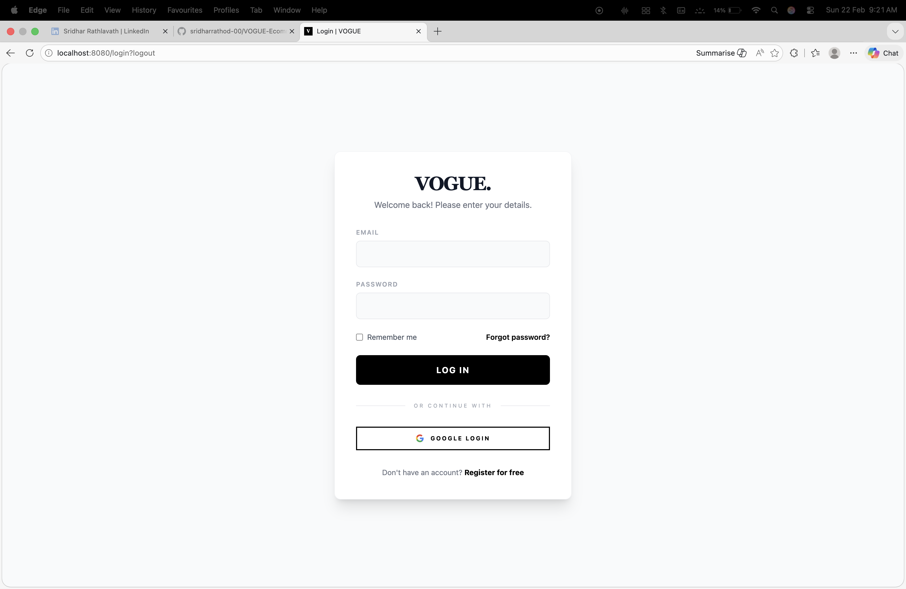
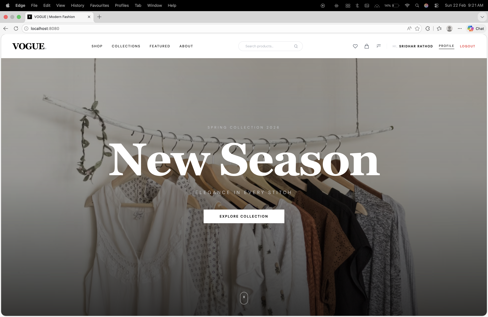
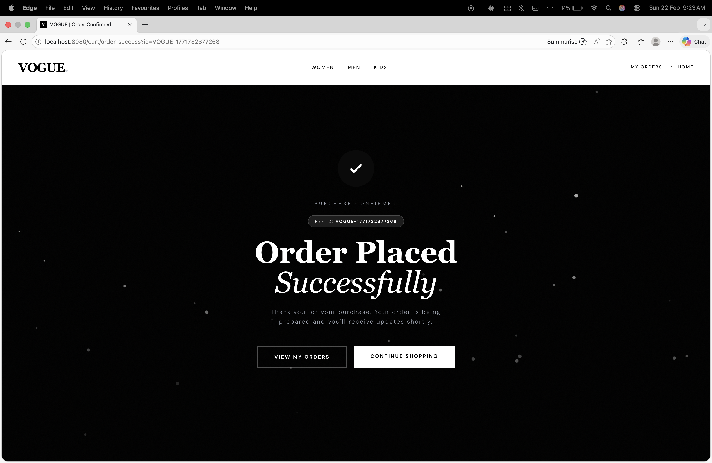

# VOGUE – E-commerce Management System

## Overview
VOGUE is a full-stack E-commerce web application built using Java and Spring Boot. The system allows users to browse products, add items to cart, place orders, and manage their profile. It also provides an Admin dashboard for product and order management.

## Tech Stack
- Java
- Spring Boot
- Spring Security
- Google OAuth Login
- MySQL
- Thymeleaf
- HTML, CSS, Tailwind
- Maven

## Features
### User Features
- User Registration & Login
- Google OAuth Authentication
- Browse products by category
- Add to Cart / Remove from Cart
- Wishlist / Favorites
- Place Orders
- Order History
- Email Notifications

### Admin Features
- Admin Dashboard
- Add / Update / Delete Products
- View and Manage Orders

## Project Architecture
Spring Boot MVC Architecture:
- Controller Layer
- Service Layer
- Repository Layer
- Entity Layer

## How to Run
1. Clone the repository
2. Create MySQL database:
   e_commerce
3. Update application.properties with your credentials
4. Run:
   mvn spring-boot:run

## Author
Sridhar Rathod  
Java Full Stack Developer (Fresher)

## Screenshots

### Login Page

### Home Page

### Admin Dashboard

### Orders

## Demo Video
https://drive.google.com/drive/folders/1fTPwPOETuVvJGgNcRzpOk7_wgTsQwCeq?usp=sharing
